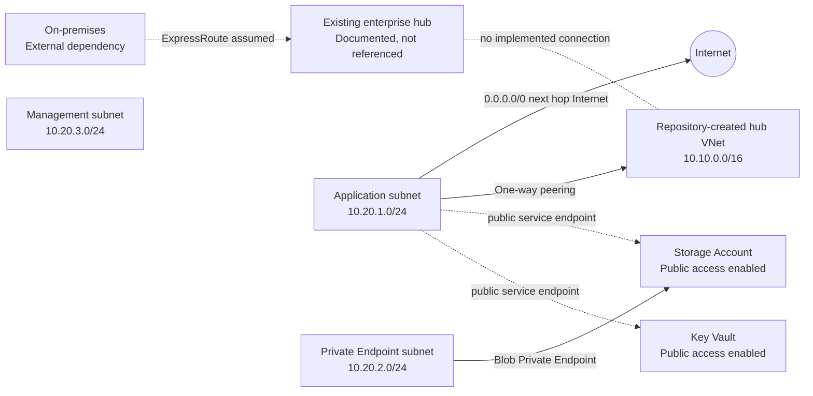

# Azure Networking Assessment Dashboard

> **Assessment Status:** Action Required  
> **Environment:** Test  
> **Azure Region:** Canada Central  
> **Assessment Scope:** Documented network requirements and Terraform under `infra/`  
> **Last Assessment:** 2026-08-19

## Executive Summary

The repository does not implement the required hub-integrated, private-only network path. The spoke is connected in only one direction to a new, otherwise empty hub VNet created by this repository rather than to the documented existing enterprise hub, and workload Internet traffic is explicitly routed directly to the Internet instead of the central Azure Firewall. Storage and Key Vault retain public network access; Key Vault has no Private Endpoint, and Private DNS integration is incomplete. Internet-sourced HTTPS and RDP NSG rules also conflict with the stated security requirements, although no public ingress resource is defined in this repository.

## Assessment Overview

| Metric | Result |
|---|---:|
| Critical Findings | 0 |
| High Findings | 6 |
| Medium Findings | 1 |
| Low Findings | 0 |
| Requirements Met | 1 |
| Requirements Partially Met | 3 |
| Requirements Not Met | 9 |
| Requirements Unable to Validate | 2 |

## Assessment Scorecard

| Area | Status | Critical | High | Medium | Low |
|---|---|---:|---:|---:|---:|
| Network Topology | ❌ | 0 | 1 | 0 | 0 |
| Routing & Egress | ❌ | 0 | 1 | 0 | 0 |
| Network Security | ⚠️ | 0 | 0 | 1 | 0 |
| Private Connectivity | ❌ | 0 | 2 | 0 | 0 |
| DNS | ❌ | 0 | 1 | 0 | 0 |
| Hybrid Connectivity | ❌ | 0 | 1 | 0 | 0 |
| Resiliency | ⚠️ | 0 | 0 | 0 | 0 |

## Critical Findings

No Critical findings were identified. The repository does not define a complete public ingress path, so the permissive NSG rules are not classified as confirmed public exposure.

## High Findings

### NET-001 — Spoke targets a repository-created empty hub

**Area:**  
Network Topology / Hybrid Connectivity

**Evidence:**  
`docs/network-requirements.md` — an existing central hub provides Azure Firewall, ExpressRoute, and enterprise DNS services  
`infra/network.tf` — `azurerm_virtual_network.hub` creates a new `10.10.0.0/16` VNet; `app_to_hub` targets that VNet

**Observed State:**  
The deployment creates its own hub VNet and peers the application VNet to it. No firewall, gateway, DNS resolver, or link to the documented enterprise hub is defined.

**Expected State:**  
The spoke must connect to the existing platform-managed hub that contains or reaches the shared firewall, ExpressRoute gateway, and enterprise DNS forwarding path.

**Risk:**  
The deployed spoke cannot use the required shared connectivity and may also conflict with enterprise address space if `10.10.0.0/16` already belongs to the existing hub.

**Recommendation:**  
Replace the managed hub VNet resource with a data source or explicit input for the existing hub VNet ID and create the spoke-side peering against that resource. Confirm subscription, resource group, permissions, and non-overlapping CIDRs with the platform team before deployment.

**Dependencies / Considerations:**  
The platform team must provide the authoritative hub resource ID and approve cross-resource-group or cross-subscription peering.

### NET-002 — Bidirectional hub and hybrid connectivity is incomplete

**Area:**  
Hybrid Connectivity

**Evidence:**  
`docs/network-requirements.md` — requires functional bidirectional hub connectivity and private on-premises access  
`infra/network.tf` — only `azurerm_virtual_network_peering.app_to_hub` exists

**Observed State:**  
Only spoke-to-hub peering is configured. No hub-to-spoke peering exists, and no configuration demonstrates gateway transit or a functional on-premises return path.

**Expected State:**  
Peering must exist in both directions with forwarded traffic and gateway transit settings aligned to the platform hub design.

**Risk:**  
Hub services and on-premises clients cannot establish the required bidirectional path to the spoke. Return traffic or propagated hybrid routes may also fail.

**Recommendation:**  
Coordinate creation of the reverse peering in the hub ownership boundary. Configure `allow_forwarded_traffic` in both directions and, where the existing ExpressRoute gateway is shared through peering, configure hub gateway transit and spoke remote-gateway use according to the platform design.

**Dependencies / Considerations:**  
Gateway transit settings cannot be confirmed without the externally managed hub and ExpressRoute configuration.

### NET-003 — Workload egress bypasses the central firewall

**Area:**  
Routing & Egress

**Evidence:**  
`docs/network-requirements.md` — Internet traffic must traverse Azure Firewall at `10.10.1.4`  
`infra/routing.tf` — route `default-internet` sends `0.0.0.0/0` to next hop `Internet`

**Observed State:**  
The application subnet route table explicitly sends default traffic directly to the Internet. No route references the firewall private IP.

**Expected State:**  
The application subnet must use a `0.0.0.0/0` route with next hop type `VirtualAppliance` and next hop address `10.10.1.4`, with a valid return path through the hub.

**Risk:**  
Internet-bound workload traffic bypasses mandatory centralized inspection, policy enforcement, and logging.

**Recommendation:**  
Replace the Internet next hop with the documented firewall virtual-appliance next hop after correcting hub connectivity. Confirm firewall policy, SNAT behavior, forwarded-traffic peering settings, and return routing with the platform team.

**Dependencies / Considerations:**  
The central firewall is external to this repository; its policy and route handling require platform-team validation.

### NET-004 — Storage public access remains enabled

**Area:**  
Private Connectivity

**Evidence:**  
`docs/network-requirements.md` — Storage must use private connectivity with public access disabled  
`infra/storage.tf` — `public_network_access_enabled = true`; network default action is `Allow`

**Observed State:**  
A Blob Private Endpoint exists in the designated subnet, but the Storage Account public endpoint remains enabled and accepts network traffic by default.

**Expected State:**  
Public network access must be disabled after the private path and DNS are operational.

**Risk:**  
Storage traffic can bypass the intended private network path and associated enterprise network controls.

**Recommendation:**  
Complete Private Endpoint DNS integration, validate workload and on-premises resolution/connectivity, then set `public_network_access_enabled = false`. Remove or tighten obsolete public network rules.

**Dependencies / Considerations:**  
Private DNS remediation in NET-006 must be completed first to avoid an outage.

### NET-005 — Key Vault lacks required private connectivity

**Area:**  
Private Connectivity

**Evidence:**  
`docs/network-requirements.md` — Key Vault requires private connectivity and disabled public access  
`infra/keyvault.tf` — `public_network_access_enabled = true`  
Repository search — no Key Vault Private Endpoint or `privatelink.vaultcore.azure.net` Private DNS zone exists

**Observed State:**  
Key Vault exposes its public network endpoint and has no Private Endpoint.

**Expected State:**  
Key Vault must have a `vault` Private Endpoint in the designated Private Endpoint subnet, private DNS integration, and public network access disabled.

**Risk:**  
Key Vault cannot be consumed over the mandatory private path, and network access is not constrained to approved private networks.

**Recommendation:**  
Create a Key Vault Private Endpoint for subresource `vault`, integrate `privatelink.vaultcore.azure.net` with the spoke and hub DNS path, validate resolution and access, and disable public network access.

**Dependencies / Considerations:**  
Coordinate DNS zone ownership and hub linking with the platform team before disabling public access.

### NET-006 — Private Endpoint DNS integration is incomplete

**Area:**  
DNS

**Evidence:**  
`docs/network-requirements.md` — Private Endpoint names must resolve from the spoke and on-premises through the hub DNS path  
`infra/storage.tf` — Blob Private DNS zone exists, but no `azurerm_private_dns_zone_group` or VNet links exist  
Repository search — no Key Vault Private DNS zone or links exist

**Observed State:**  
The Blob zone is not associated with the Storage Private Endpoint and is linked to neither the spoke nor hub. Key Vault DNS resources are absent.

**Expected State:**  
Each Private Endpoint must register in the correct zone. The spoke must resolve those zones, and the hub enterprise DNS path must be able to resolve or forward them for on-premises clients.

**Risk:**  
Clients may resolve public service addresses or fail name resolution, preventing reliable private access even where a Private Endpoint exists.

**Recommendation:**  
Add Private DNS zone groups for Storage Blob and Key Vault. Link the zones to the application VNet and make them available to the actual hub DNS forwarding path using the platform team's established zone ownership and forwarding model.

**Dependencies / Considerations:**  
Validate whether Private DNS zones are centrally managed. Do not create duplicate zones if the platform team owns them.

## Medium Findings

### NET-007 — NSGs permit broad Internet-sourced application and management traffic

**Area:**  
Network Security

**Evidence:**  
`docs/network-requirements.md` — application subnets must not accept direct Internet inbound traffic; RDP/SSH must not be opened to the Internet; rules must follow least privilege  
`infra/security.tf` — application NSG allows `Internet` to TCP/443; management NSG allows `Internet` to TCP/3389

**Observed State:**  
Both subnet NSGs contain broad Internet-sourced allow rules. No public IP, public load balancer, Application Gateway, or Bastion is defined in the repository, so a complete public ingress path is not confirmed.

**Expected State:**  
Inbound access must use approved private sources and ports. Administration must use a private management path or an approved managed service such as Azure Bastion under the enterprise design.

**Risk:**  
The rules violate the least-privilege intent and create latent exposure if a public ingress resource is later attached or introduced outside this repository.

**Recommendation:**  
Remove both Internet-sourced rules. Add only explicitly required source CIDRs or service tags, destination scopes, and ports after the approved application ingress and administration paths are defined.

**Dependencies / Considerations:**  
Confirm approved on-premises address ranges and application ingress architecture before adding replacement rules.

## Low Findings

No Low findings were identified.

## Architecture Observations

**Observed in repository**

- A dedicated application VNet contains application, Private Endpoint, and management subnets.
- A separate hub-named VNet is created locally, with only spoke-to-hub peering.
- The application subnet has an NSG and a route table whose default route uses the Internet next hop.
- Storage has a Blob Private Endpoint, but Storage and Key Vault both retain public access.
- A Blob Private DNS zone exists without endpoint association or VNet links.

**Assumed external/shared platform dependency**

- Existing enterprise hub VNet and authoritative resource ID.
- Azure Firewall at `10.10.1.4` and its policy.
- ExpressRoute circuit and gateway in the enterprise hub.
- Enterprise DNS forwarders or Azure DNS Private Resolver in the hub.
- Hub-managed peering, gateway transit, routes, and DNS zone links.

## Architecture Diagram

## Requirements Compliance

| ID | Requirement | Status | Evidence | Notes |
|---|---|---|---|---|
| REQ-001 | Dedicated workload spoke VNet | ✅ Met | `infra/network.tf` / `azurerm_virtual_network.app` | Dedicated `10.20.0.0/16` VNet exists. |
| REQ-002 | Functional bidirectional hub connectivity | ❌ Not Met | `infra/network.tf` / `app_to_hub` | Wrong hub target and only one peering direction. |
| REQ-003 | Internet egress through firewall `10.10.1.4` | ❌ Not Met | `infra/routing.tf` / `default-internet` | Next hop is `Internet`. |
| REQ-004 | On-premises private access to approved endpoints | ❌ Not Met | `infra/network.tf`; repository search | No functional connection to the enterprise hub or demonstrated return path. |
| REQ-005 | Storage uses private connectivity | ⚠️ Partially Met | `infra/storage.tf` / `storage_blob` | Private Endpoint exists; DNS and private-only enforcement are incomplete. |
| REQ-006 | Key Vault uses private connectivity | ❌ Not Met | `infra/keyvault.tf`; repository search | No Key Vault Private Endpoint. |
| REQ-007 | Backend PaaS public access disabled | ❌ Not Met | `infra/storage.tf`; `infra/keyvault.tf` | Both resources explicitly enable public network access. |
| REQ-008 | Private Endpoints use designated subnet | ⚠️ Partially Met | `infra/storage.tf` / `storage_blob` | Storage complies; required Key Vault endpoint is absent. |
| REQ-009 | Private names resolve from application spoke | ❌ Not Met | `infra/storage.tf`; repository search | No zone group or spoke VNet link. |
| REQ-010 | Private names resolve from on-premises through hub | ❌ Not Met | Repository search | No hub link or forwarding integration is represented. |
| REQ-011 | Application subnet rejects direct Internet inbound | ⚠️ Partially Met | `infra/security.tf` / application NSG | NSG allows Internet HTTPS, but no public ingress resource is defined. |
| REQ-012 | RDP/SSH not opened directly to Internet | ❌ Not Met | `infra/security.tf` / management NSG | Internet-to-RDP allow rule exists. |
| REQ-013 | Network rules follow least privilege | ❌ Not Met | `infra/security.tf` | Broad Internet source and wildcard destination rules are used. |
| REQ-014 | ExpressRoute terminates in existing hub | ❓ Unable to Validate | `docs/network-requirements.md` | Externally managed and not represented in Terraform. |
| REQ-015 | Enterprise DNS forwarding terminates in hub | ❓ Unable to Validate | `docs/network-requirements.md` | Externally managed and not represented in Terraform. |

## Recommended Remediation Plan

| Priority | Finding | Recommendation | Area | Effort | Impact |
|---|---|---|---|---|---|
| P1 | NET-001 | Reference and peer to the authoritative existing enterprise hub. | Topology | Medium | High |
| P1 | NET-002 | Establish reverse peering and required forwarded traffic/gateway transit settings. | Hybrid Connectivity | Medium | High |
| P1 | NET-003 | Route default egress to `10.10.1.4` after hub connectivity is corrected. | Routing | Low | High |
| P1 | NET-006 | Implement endpoint zone groups and spoke/hub DNS integration. | DNS | Medium | High |
| P1 | NET-005 | Add Key Vault Private Endpoint and then disable its public access. | Private Connectivity | Medium | High |
| P1 | NET-004 | Validate private Storage access and disable its public access. | Private Connectivity | Low | High |
| P2 | NET-007 | Remove Internet-sourced NSG rules and define approved private sources. | Network Security | Low | Medium |

## Positive Findings

- The default region is correctly set to Canada Central.
- The application uses a dedicated spoke VNet with non-overlapping application, Private Endpoint, and management subnets within the repository-defined address plan.
- The Storage Blob Private Endpoint targets the correct `blob` subresource and designated Private Endpoint subnet.
- TLS 1.2 is required for Storage, anonymous nested-item publication is disabled, and Key Vault uses RBAC authorization.
- NSGs and the application route table are explicitly associated with their intended subnets, avoiding unattached controls.

## Assumptions & Validation Required

### ASSUMPTION-001 — Existing hub address and ownership

**Reason:**  
The requirements identify an existing hub and firewall IP but do not provide the hub resource ID, subscription, resource group, or confirmed CIDR. The repository creates a VNet using the documented hub CIDR instead of referencing an external resource.

**Validation Required:**  
Obtain the authoritative hub resource ID, address space, peering ownership model, and deployment permissions from the platform team.

### ASSUMPTION-002 — ExpressRoute and return routing

**Reason:**  
ExpressRoute is explicitly external and its gateway, route propagation, advertised prefixes, and return routes are unavailable for inspection.

**Validation Required:**  
Confirm gateway transit design, on-premises advertised prefixes, hub route tables, firewall return path, and spoke prefix propagation with the platform team.

### ASSUMPTION-003 — Enterprise DNS ownership

**Reason:**  
The external DNS forwarders or Private Resolver and their rulesets are not present in the repository.

**Validation Required:**  
Confirm whether Private DNS zones are centrally owned, how the hub resolver reaches them, and whether on-premises conditional forwarders target the approved hub inbound endpoint.

### ASSUMPTION-004 — No external public ingress resources

**Reason:**  
No public ingress resource exists in this repository, but resources managed elsewhere cannot be excluded from the available evidence.

**Validation Required:**  
Inspect deployed NIC public IPs, load balancers, Application Gateways, firewalls, and external platform resources before concluding that the NSG rules are unreachable from the Internet.

### ASSUMPTION-005 — Shared-services resiliency

**Reason:**  
The zone redundancy and failover design of the external firewall, ExpressRoute gateways, and DNS components are unavailable.

**Validation Required:**  
Confirm platform resiliency, gateway SKU/redundancy, firewall availability zones, DNS resolver redundancy, and operational failover testing.

## Assessment Summary

**Overall Status:** Action Required

**Findings**

- Critical: 0
- High: 6
- Medium: 1
- Low: 0

**Top Three Priority Actions**

1. Connect the spoke bidirectionally to the actual enterprise hub and validate ExpressRoute return routing.
2. Replace direct Internet egress with the required Azure Firewall route through `10.10.1.4`.
3. Complete Storage and Key Vault Private Endpoints/DNS integration, then disable public network access.

**Next Step**

Obtain the enterprise hub resource ID and DNS ownership model from the platform team, then update and validate the spoke connectivity dependency chain before disabling PaaS public access.